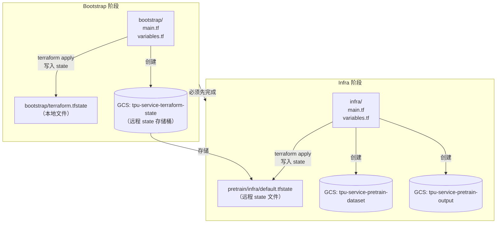
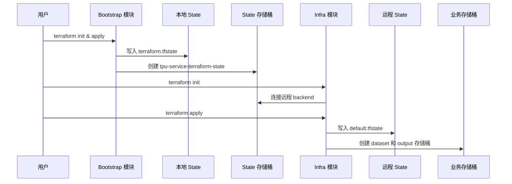

# 预训练基础设施

用于创建 GCS 存储桶的 Terraform 配置，存储预训练数据集和模型检查点。

## Terraform 基础知识

### 什么是 Terraform

Terraform 是一个基础设施即代码（IaC）工具。你不需要在 GCP 控制台手动点击按钮来创建资源（如存储桶），而是通过声明式编程的方式来获取资源。

### Terraform 工作流程

Terraform 分三步操作：

```
terraform init    # 下载 provider（如 google provider）
terraform plan    # 预览将要创建/修改/销毁的内容
terraform apply   # 实际创建/修改/销毁资源
```

### 什么是 State

当 Terraform 创建资源时，它需要记住创建了什么。这些信息存储在 **state 文件**（`terraform.tfstate`）中。

例如，创建 GCS 存储桶后，state 文件记录：
- 存储桶的名称、位置和所有属性
- 存储桶在 GCP 中的唯一 ID
- 没有 state，Terraform 不知道它管理着哪些资源
- 下次运行 `terraform apply` 时，它会尝试创建重复的资源

### 配置文件 vs State 文件

一个常见的疑问：既然配置文件可以通过 Git 共享，为什么还需要单独管理 state 文件？

| 类型 | 内容 | 示例 |
|------|------|------|
| **配置文件** (main.tf) | 声明"想要什么资源" | `name = "my-bucket"` |
| **State 文件** (terraform.tfstate) | 记录"实际创建了什么" | `id = "projects/xxx/buckets/my-bucket"` |

State 文件包含配置文件中没有的**运行时信息**：

```json
{
  "resources": [{
    "type": "google_storage_bucket",
    "instances": [{
      "attributes": {
        "id": "tpu-service-pretrain-dataset",
        "self_link": "https://www.googleapis.com/storage/v1/b/...",
        "url": "gs://tpu-service-pretrain-dataset",
        "project": "tpu-service-473302"
      }
    }]
  }]
}
```

### 为什么 State 不放 Git

State 文件不应该提交到 Git 仓库：

1. **敏感数据**：State 可能包含数据库密码、API 密钥等敏感信息
2. **频繁变更**：每次 `terraform apply` 都会修改 state 文件
3. **合并冲突**：State 是 JSON 格式，Git 合并冲突难以解决
4. **并发问题**：多人同时 `apply` 可能导致 state 损坏

### 为什么需要远程 State

**本地 State** 存储在你的机器上（`./terraform.tfstate`）：
- 其他团队成员无法访问
- 机器故障会导致 state 丢失
- 无法防止多人同时操作

**远程 State** 存储在共享位置（如 GCS 存储桶）：
- 所有团队成员访问同一份 state
- 自动备份和版本控制
- 支持 state 锁定，防止并发修改冲突

**何时需要远程 State**：
- 团队协作（多人操作同一套基础设施）
- CI/CD 自动化部署
- 需要可靠的备份和恢复

**何时可以使用本地 State**：
- 单人操作
- 实验性项目
- 快速原型验证

本项目采用远程 State，为后续团队协作做准备。

### Bootstrap 问题

要使用 GCS 作为远程 state 存储，你需要一个 GCS 存储桶。但要用 Terraform 创建 GCS 存储桶，你需要一个地方来存储 state。这是一个先有鸡还是先有蛋的问题。

解决方案：使用带有本地 state 的 **bootstrap** 模块先创建 state 存储桶。

## 我们构建了什么

```
terraform/
├── bootstrap/          # 创建 state 存储桶（使用本地 state）
│   ├── main.tf
│   ├── variables.tf
│   └── outputs.tf
└── infra/              # 创建实际基础设施（使用远程 state）
    ├── main.tf
    ├── variables.tf
    └── outputs.tf
```

### Bootstrap 模块

用途：创建用于存储 Terraform state 文件的 GCS 存储桶。

创建的内容：
- `tpu-service-terraform-state` 存储桶

这个模块使用**本地 state**，因为远程 state 存储桶还不存在。运行 bootstrap 后，state 存储在本地机器的 `bootstrap/terraform.tfstate`。

### Infra 模块

用途：为预训练工作负载创建 GCS 存储桶。

创建的内容：
- `tpu-service-pretrain-dataset` - 存储预训练数据集
- `tpu-service-pretrain-output` - 存储模型检查点和输出

这个模块使用**远程 state**，存储在 bootstrap 创建的存储桶中：
```
gs://tpu-service-terraform-state/pretrain/infra/default.tfstate
```

## 数据流图



### 流程说明



## 前置条件

- Terraform >= 1.14.3
- 已安装并配置 Google Cloud SDK

## 使用方法

### 步骤 1：初始化 Bootstrap

这只需要由项目创建者运行一次。

```bash
cd bootstrap
terraform init
terraform plan
terraform apply
```

成功 apply 后，将创建 state 存储桶 `tpu-service-terraform-state`。

注意：`bootstrap/terraform.tfstate` 文件存储在本地。请将其备份到安全的位置。

### 步骤 2：部署基础设施

```bash
cd ../infra
terraform init
terraform plan
terraform apply
```

这将创建：
- `tpu-service-pretrain-dataset` - 用于预训练数据集的 GCS 存储桶
- `tpu-service-pretrain-output` - 用于模型检查点和输出的 GCS 存储桶

### 步骤 3：获取存储桶 URL

```bash
terraform output
```

## 自定义配置

通过创建 `terraform.tfvars` 文件覆盖默认值：

```hcl
# infra/terraform.tfvars
project_id                  = "your-project-id"
dataset_storage_bucket_name = "your-dataset-bucket"
output_storage_bucket_name  = "your-output-bucket"
location                    = "us-central1"
dataset_lifecycle_age       = 90
output_lifecycle_age        = 30
```

## 销毁资源

销毁基础设施：

```bash
# 先销毁 infra
cd infra
terraform destroy

# 然后销毁 bootstrap（如果需要）
cd ../bootstrap
terraform destroy
```

## 新团队成员

如果你克隆了这个仓库且基础设施已经存在：

1. 跳过 bootstrap 步骤（state 存储桶已存在）
2. 直接进入 `infra/` 并运行：
   ```bash
   terraform init    # 这将连接到远程 state
   terraform plan    # 验证不需要任何更改
   ```
3. 现在你可以访问共享的 state 并进行更改
